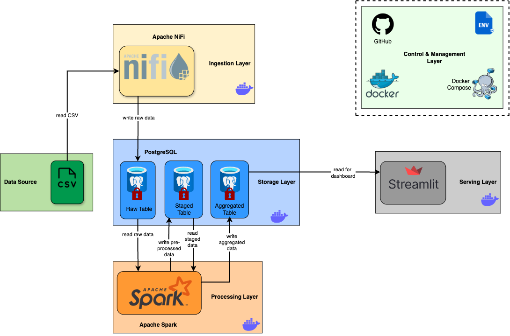
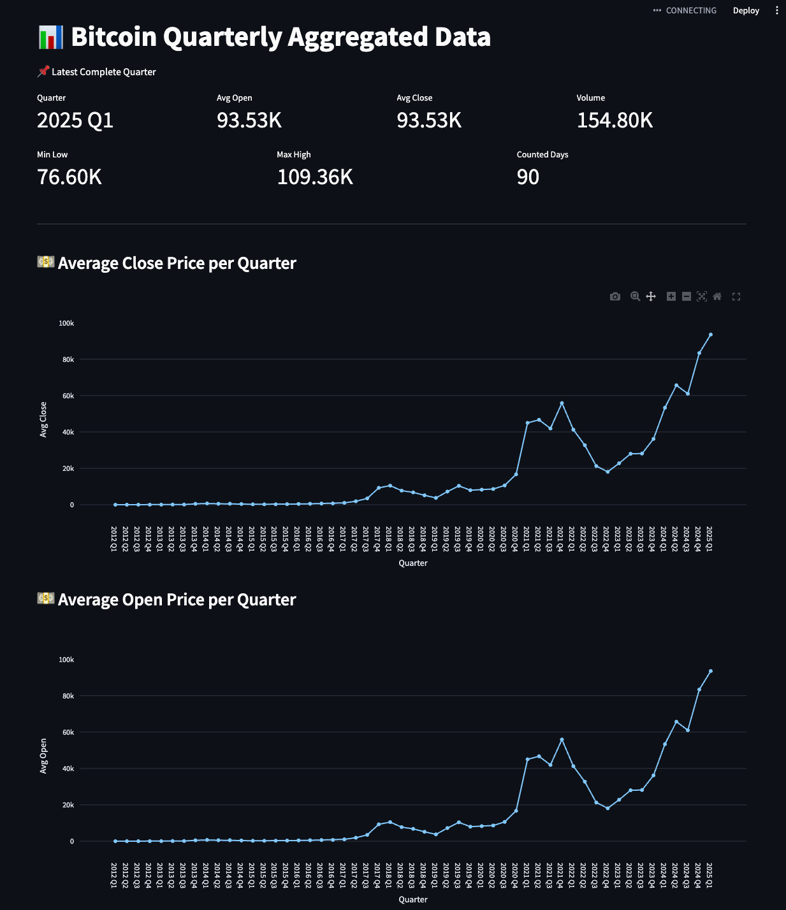
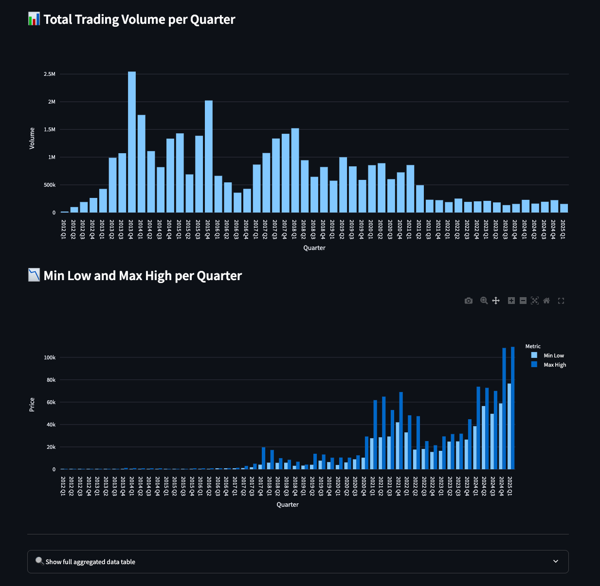

# 📦 Projekt: Data Engineering (Bitcoin)

Dieses Projekt zeigt eine vollständige datengetriebene Pipeline zur Verarbeitung, Aggregation und Visualisierung von 
Bitcoin-Marktdaten auf Quartalsbasis. Die Architektur basiert auf Microservices, die mithilfe von Docker orchestriert 
und lokal ausgeführt werden können.


## 🚀 Zielsetzung

Ziel des Projekts ist der Aufbau einer modularen, skalierbaren und wartbaren Datenpipeline mit Fokus auf:

- **Ingestion** (Apache NiFi)
- **Verarbeitung** (Apache Spark)
- **Persistenz** (PostgreSQL)
- **Visualisierung** (Streamlit)
- **Reproduzierbarkeit** (Docker, Git, .env)

---

## 🧱 Architekturübersicht



Die Pipeline besteht aus folgenden Komponenten:

| Schicht              | Komponente     | Aufgabe                                   |
|----------------------|----------------|-------------------------------------------|
| Ingestion Layer      | Apache NiFi    | Import von Rohdaten aus CSV               |
| Storage Layer        | PostgreSQL     | Speicherung von Roh-, Staging- und Aggregatdaten |
| Processing Layer     | Apache Spark   | Transformation und Aggregation            |
| Serving Layer        | Streamlit      | Interaktives Dashboard zur Datenanalyse   |
| Control & Management | Docker Compose | Orchestrierung der Microservices          |

---

## 🔧 Setup & Ausführung

### 🔑 Voraussetzungen

- Docker & Docker Compose
- Git

### ▶️ Start

```bash
git clone https://github.com/jan-wun/Projekt-Data-Engineering.git
cd Projekt-Data-Engineering
docker-compose up --build
```

Die Ausführung der Pipeline kann je nach Hardware einige Minuten in Anspruch nehmen.

Die Anwendung bzw. das Streamlit Dashboard ist dann unter [http://localhost:8501](http://localhost:8501) erreichbar.

---

## 📊 Visualisierung (Streamlit Dashboard)

Das Dashboard stellt folgende Metriken quartalsweise dar:

- 📈 Durchschnittlicher Open-/Close-Preis
- 💵 Gesamtvolumen (total trading volume)
- 📉 Min Low / Max High Preis

Für das letzte vollständige Quartal sind die Metriken zudem übersichtlich aufgelistet.




---

## 🗃️ Datenverarbeitung

- Die Pipeline liest Rohdaten im CSV-Format via Apache NiFi ein.
- Spark transformiert die Daten in zwei Stufen:
  - **Staging**: Umwandlung von Unix-Timestamps in `datetime`, Validierung, Bereinigung
  - **Aggregation**: Gruppierung nach Quartal mit berechneten Metriken (avg, min, max, sum)

---

## ✅ Features

- ⛓️ Automatische Abhängigkeitserkennung mit `wait-for-table.sh`
- 🔁 Wiederholbare Verarbeitung dank Containerisierung
- 🔒 Zugriffsschutz für sensible Daten über `.env`
- 🧪 Robuste Validierung & Fehlerbehandlung

---

## 🛠️ Weiterentwicklung

Mögliche Erweiterungen:

- Echtzeitdaten via Kafka
- Monitoring mit Grafana/Prometheus
- Logging mit ELK Stack
- Cloud-Deployment (z. B. AWS, Azure, GCP)

---

## 📁 Projektstruktur (Kurzform)

```
├── data/
│   └── btcusd_1-min_data.csv
├── drivers/
│   └── postgresql-42.7.3.jar
├── nifi/
│   └── Dockerfile
│   └── flow.xml.gz
├── spark/
│   └── Dockerfile
│   ├── transform_bitcoin_data.py
│   └── wait-for-table.sh
├── sql/
│   ├── init_postgres.sql
├── sql/
│   └── init.sql
├── streamlit/
│   ├── app.py
│   └── Dockerfile
│   ├── requirements.txt
│   └── wait-for-table.sh
├── .env
├── docker-compose.yml
├── README.md

```

---

## 👤 Autor

**Jan Wunderlich**
